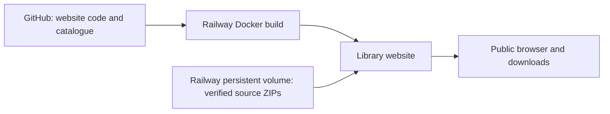

# Thunder Buddies Open Source Library

A public, searchable archive of editable Arma Reforger mod projects by
Thunder Buddies Studios. Original material is released under the custom
Thunder Buddies Attribution License 1.0, not standard MIT or an OSI-approved
license. Separately licensed components retain their own terms.

Required credit: **Includes work by Thunder Buddies Studios.**
Place it in the public mod description, distributed README, or an accessible
credits page. A mod-name change is not required. See [LICENSE.txt](LICENSE.txt).

## Deployment architecture

This repository contains only the small website, server, catalogue, license,
and tests. Mod ZIPs and upload credentials must never be committed here.
The service runs independently of the maintainer's PC. `/data` must be a
persistent Railway volume; rebuilding the website does not replace that data.

## Running

Python 3.13, no third-party packages. Run `python server.py` or build the
Dockerfile. Configure `PORT` (default 8080), `DATA_DIR` (default /data), and
optionally `UPLOAD_TOKEN` during an authorized import. Without an upload
token the upload route is disabled. Keep the token in Railway variables.

Run tests with `python -m unittest test_server.py`.

## Releases and integrity

Each immutable-name mod ID maps to a ZIP and JSON receipt on the volume.
An archive appears as downloadable only after its ZIP CRC check passes and
its SHA-256/size receipt is saved. Downloads require no user account and
archives have no password. HTTPS protects transfers.

The catalogue is an inventory, not a gameplay certification. Some original
projects are minimal prototypes. Dependencies are listed in the source
project metadata; source releases do not bundle every Workshop dependency.

Archives include the attribution license and release notes. Owner-authored
legacy restrictive EULAs are replaced in release copies, not in original
Workbench folders. Third-party notices remain intact. Private files,
repository history, saves, caches, and logs are excluded during preparation.

## Operational limits

The current server accepts one authenticated upload at a time, with a 4 GiB
compressed / 12 GiB expanded archive limit. It never extracts uploaded ZIPs.
Downloads stream from disk. Railway storage and download egress incur charges.
Volume backups should be configured separately; a single volume is not a
backup. Tests cover upload authorization, ZIP verification, download hashes,
catalogue output, and path traversal rejection.

## Exploring the library

Search project names, descriptions, registered GUIDs, or dependency names and
IDs. Filter by category and download availability; sort by name, source size,
or dependency count. Each project has a shareable detail drawer with overview,
dependency, and license-history tabs. The layout supports narrow screens,
keyboard navigation, focus restoration, and reduced motion.

Project GUIDs come from original `.gproj` files. A GUID does not prove a public
Workshop release exists. Cached Workshop descriptions and names are identified
as snapshots; unresolved dependency names remain explicit. Categories are
library classifications, not publisher-assigned tags. Former owner-authored
licenses are historical information, replaced for this library release only.
Retained third-party notices are shown separately and remain applicable.

HTTP byte ranges support resumed downloads. Integrity verification checks
transfer bytes and ZIP CRCs, not gameplay compatibility or a full code audit.

## Studio history

`/story` presents eight chapters adapted from the studio-supplied Detailed
Timeline Biography (December 2025 to September 2026) and the subsequent closure
and library-release statements. It distinguishes announced plans from released
systems and omits private incident details. The library uses compact charcoal
rows, direct Workshop/license links, and motion that respects reduced-motion
preferences.

Workshop identity rule: a local `.gproj` GUID is never sufficient to create a
Workshop link. Public Workshop names, IDs and links require an explicit match
to an official Workshop page record. Unmatched projects retain their local
folder names and show an unconfirmed-listing label. Dependency links follow the
same rule. Page snapshots are evidence of a listing, not a guarantee that its
current visibility or content has remained unchanged.

Download counters use SQLite at `/data/download-counts.sqlite3` on the persistent Railway volume. Atomic increments occur after a full HTTP 200 response is written and flushed; HEAD, failed writes, and partial/resumed 206 responses are excluded. These are server transfers, not unique people or proof of a saved file. No user identifiers are recorded. Counts start at deployment; historical downloads cannot be reconstructed. Include the database in volume backups.
